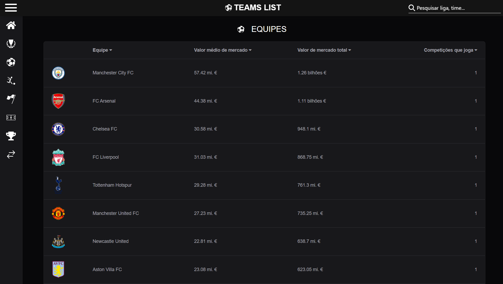

# Nome do projeto




> Almanaque futebolístico que reúne dados de mais de 100.000 jogadores, 3.700 equipes e 250 ligas.

### Ajustes e melhorias

O projeto ainda está em desenvolvimento e as próximas atualizações serão voltadas nas seguintes tarefas:

- [x] Realizar deploy na Google Cloud Service
- [x] Criar página de estádios
- [x] Relacionar troféus à equipes
- [ ] Criar a página de transferências de jogadores
- [ ] Buscar informações adicionais de jogadores

## 💻 Pré-requisitos

Antes de começar, verifique se você atendeu aos seguintes requisitos:

- Você instalou a versão mais recente do `python` em sua máquina

## ☕ Rodando o Teamlist

Para rodar Teamlist, siga estas etapas após clonar o repositório:

```
python venv -m venv
```

```
pip install requirements.txt
```

```
python manage.py makemigrations
```

```
python manage.py migrate
```

```
python manage.py runserver
```

## 💻 Acessando o painel do Django

## 📫 Contribuindo para Teamlist

Para contribuir com Teamlist, siga estas etapas:

1. Bifurque este repositório.
2. Crie um branch: `git checkout -b <nome_branch>`.
3. Faça suas alterações e confirme-as: `git commit -m '<mensagem_commit>'`
4. Envie para o branch original: `git push origin Teamlist / <local>`
5. Crie a solicitação de pull.

Como alternativa, consulte a documentação do GitHub em [como criar uma solicitação pull](https://help.github.com/en/github/collaborating-with-issues-and-pull-requests/creating-a-pull-request).

## 🤝 Colaboradores

Agradecemos às seguintes pessoas que contribuíram para este projeto:

<table>
  <tr>
    <td align="center">
      <a href="#" title="defina o titulo do link">
        <br>
        <sub>
          <b>Iuri Silva</b>
        </sub>
      </a>
    </td>
    <td align="center">
      <a href="#" title="defina o titulo do link">
        <br>
        <sub>
          <b>Mark Zuckerberg</b>
        </sub>
      </a>
    </td>
    <td align="center">
      <a href="#" title="defina o titulo do link">
        <br>
        <sub>
          <b>Steve Jobs</b>
        </sub>
      </a>
    </td>
  </tr>
</table>

## 😄 Seja um dos contribuidores

Quer fazer parte desse projeto? Clique [AQUI](CONTRIBUTING.md) e leia como contribuir.

## 📝 Licença

Esse projeto está sob licença. Veja o arquivo [LICENÇA](LICENSE.md) para mais detalhes.